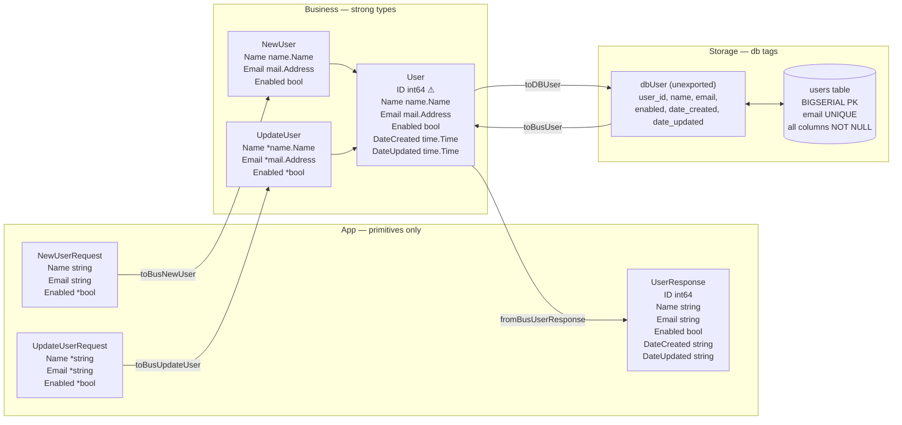
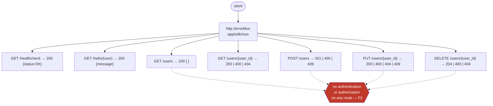
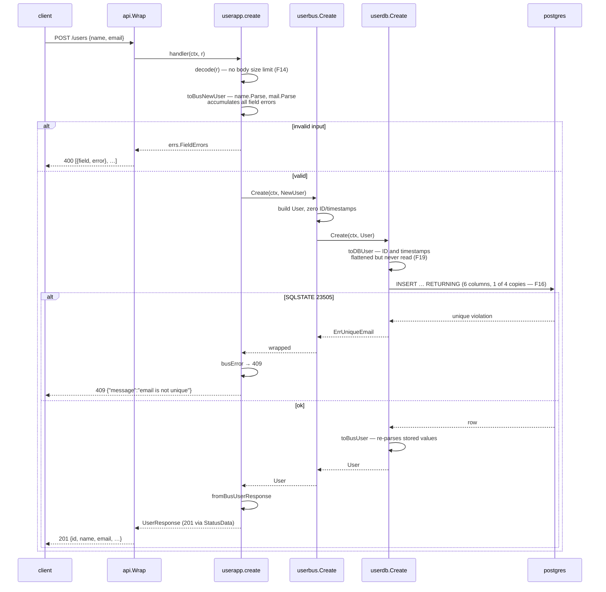
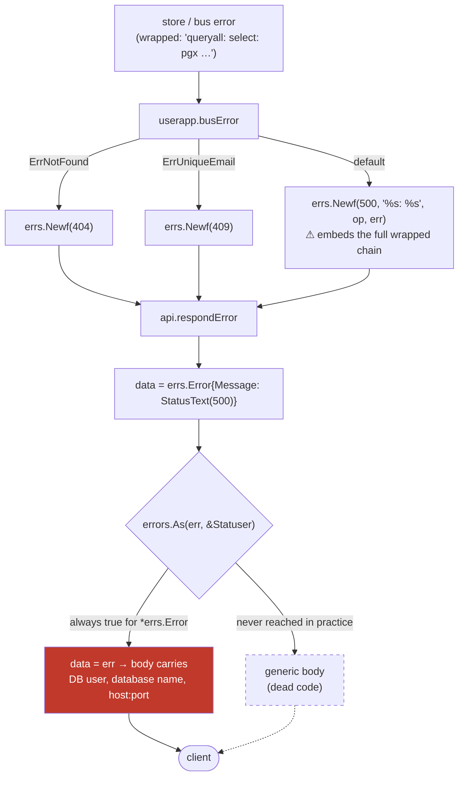
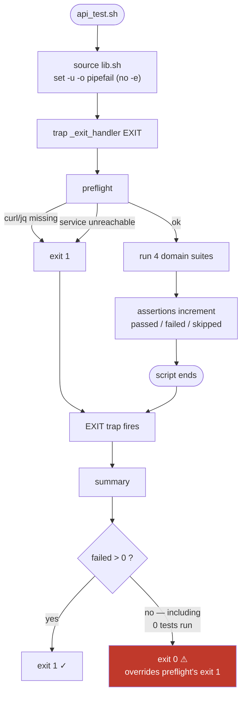
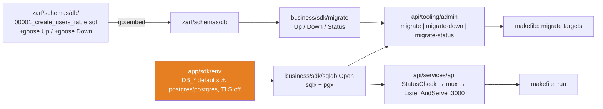

# Feature Diagrams — Users CRUD service (branch `ex-04`)

Drawn from the code as it stands on `main...HEAD`, not from the intended design.

## 1. Types across the three layers

Each layer owns its own shape; the arrows are the named converters.

`⚠ User.ID int64` is finding **F5**: the one field crossing all three layers is a bare primitive inside Business, where the layering rules require a strong type. Every other crossing is clean — no strong type reaches App JSON (both `name.Name` and `mail.Address` implement `MarshalText`, so a leak would have been silent, but `fromBusUserResponse` flattens each field explicitly), and `dbUser` is unexported so no row escapes the store.

## 2. Client contract

Two distinct error envelopes ship on the same 400 status: validation failures return a bare JSON **array** of `{field, error}`, while everything else returns an **object** `{"message": …}`. Neither shape is asserted by any test outside the field-error case (F20).

## 3. Request flow — POST /users

## 4. Error translation, and where it leaks

This is finding **F7**. The scrubbing branch reads as though 500 responses are sanitized; because every error these handlers produce satisfies `Statuser`, it is unreachable and the full chain is marshalled to the client.

## 5. Integration harness control flow — why it always exits 0

Finding **F1**, reproduced: an `exit` inside an EXIT trap replaces the script's status, so a preflight abort with zero tests executed reports success. Separately, `skip` counts as neither pass nor fail (F11), so the List-Users payload assertions vanish from the exit code on an empty database.

## 6. Migration and startup wiring

The schema move is complete — exactly one `.sql` file exists in the tree and goose discovers it as `v=1`. The orange node is finding **F13**: unset `DB_*` variables fail open to well-known credentials with TLS disabled rather than failing loudly.
